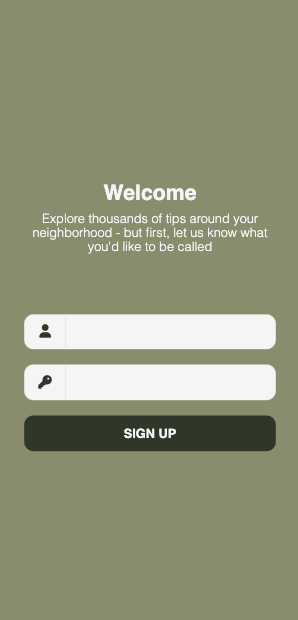
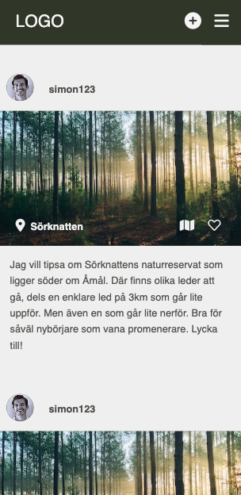
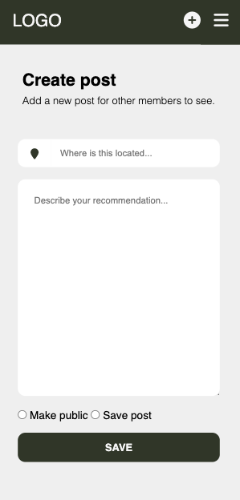

### Welcome to Dalsland Explore App

### Before starting 
We will guide you to start this app through some simples steps. Let's start with the basics. 

#### Get GitHub Repo
Clone this GitHub Repo to your own VSC. You can do this by clicking on the <>code button and then choose to clone the repo.

#### Install dependencies
To use this app you need to install following dependencies: 
npm i 

Nothing more, nothing less. That's all you need. This app is very smartley build, so I saved all the dependencies that you need in the package.json-file.

### Step 1: Create your own db
Okey, you will have to create your own db to access this app. 

1. Go to www.mongodb.com
2. Create an account if you don't already have one
3. Choose to create a new database and name it "explore-app"
4. Add two collections named "posts" and "users", make sure that you use small letters

### Step 2: Set up db
In VSC, create your own .env-file and set up:
* MONGODB_URL="insert your own db-string here"
* MONGODB_NAME="explore-app"

After the "...mongodb.net/" insert explore-app like this "...mongodb.net/explore-app" to make it work.
Make sure to use your own password in the db-string.

### Step 3: Start app
You need to write node server in the terminal to start this app. 
And paste this url into your browser: localhost:2000 

This will hopefully take you to the first Welcome page.

### How to use the app
Alright, so it looks like you've made it so far. Congrats (to us both)! Let's check out the use of the app.

#### Welcome
* Continue as a guest: If you would like to just hang around and see what other people might have posted (a bit hard when it's just connected to your own db, but you've got an imagination, don't you). Guestusers can't post something or reach the profile.
* Become a member: Join the community and create your own account to use this app and all its functions.
* Login: If you already have an account.

#### Start
In your imagination, you can see what other people might have been posting lately. If you actually want to see other posts here, you can always create other different accounts and send in your own tips from them. It's a bit... Well, we all have our problems. You can't edit your own posts here, you will need to go to your profile to do that. Let's check it out.

#### Profile
You can edit, save, make public/private or remove your own posts here. It's your own profile and no one can see the things you set to "private", but all the "public" posts will be shown at the feed. 

#### Post 
Create your own post with the plus next to the menu. Set the right location for the place you want to recommend and write something interesting that other people can take adventage of. You can choose to publish your post or save it for later. 

#### Log out
So, if you feel like you are done with this for now, you can always log out and come back later. 

